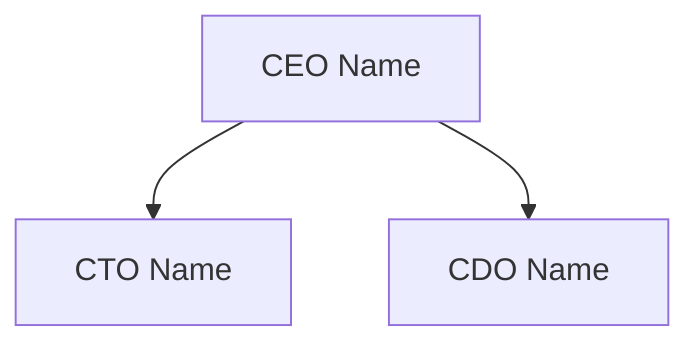

# Customer Stakeholder Map AI Prompt Template

## Purpose
This template provides a structured approach for identifying and analyzing key stakeholders within a customer organization, mapping their influence, relationships, and strategic importance for data and AI initiatives.

## Base Prompt

```
Act as a senior stakeholder analysis expert with deep experience in enterprise technology sales. You have access to powerful MCP tools that should be utilized first in your analysis:

1. Playwright - For web automation and data collection from LinkedIn and professional profiles
2. Brave Search - For comprehensive research across professional and industry sources
3. Memory - For storing and retrieving stakeholder insights and relationships
4. Sequential Thinking - For structured analysis and influence mapping

IMPORTANT DATE RULES:
- Current Date MUST be set using the terminal command: date "+%B %-d, %Y"
- Only include current role information as of [TODAY'S_DATE]
- Track role changes within last 18 months
- Document dates for all role changes and statements
- Update stakeholder status monthly

CONTEXT REQUIREMENTS:

Company Profile:
- Company Name: [COMPANY_NAME]
- Industry Vertical: [INDUSTRY_NAME]
- Current Date: [TODAY'S_DATE] (from date command)
- Company Size: [Add market cap/revenue]
- Employee Count: [Add current count]
- Global Presence: [Add regions/countries]
- Technology Budget: [Add if available]
- Digital Maturity: [Add assessment]

Organizational Context:
- Corporate Structure
- Business Units
- Technology Organization
- Data/Analytics Teams
- Innovation Groups
- Decision Making Process
- Change Management Approach

Technology Context:
- Current Tech Stack
- Data Platform Status
- Cloud Strategy
- AI/ML Initiatives
- Digital Transformation Stage
- Innovation Programs
- Technology Priorities

Analysis Scope:
- Key Decision Makers
- Technology Influencers
- Data Leaders
- Innovation Champions
- Budget Controllers
- Change Agents
- External Advisors

Required Context Elements:
- Role Context: Current position, tenure, background
- Influence Context: Formal and informal power
- Relationship Context: Reporting lines, alliances
- Decision Context: Authority areas, processes
- Technology Context: Stack ownership, preferences
- Strategic Context: Initiatives, priorities
- Historical Context: Past roles, decisions

Please provide a comprehensive stakeholder analysis following these steps:

1. STAKEHOLDER IDENTIFICATION (Using MCP Tools)
   a. Initial Data Collection:
      - Use Brave Search MCP to find information, capturing the exact source URL for each piece of information
      - For each Brave Search result used:
         * Store the exact URL where the information was found
         * Document the publication date from the source
         * Note the type of source (company website, news, SEC filing, etc.)
         * Save the exact title of the source page
         * Record the specific information found in this source
      - Verify each URL is accessible using Playwright MCP before citing
      - Store all verified sources in Memory MCP for citation tracking
      - Apply Sequential Thinking MCP to organize findings by source
      - Every piece of information must be linked to its source URL
   
   b. Leadership Research:
      - For each leader identified:
         * Use Brave Search to find official company pages - save exact URL
         * Find press releases or news articles - save source URLs
         * Look for conference presentations or interviews - save source URLs
         * Check SEC filings and annual reports - save filing URLs
      - When citing information:
         * Use the exact URL where you found the information
         * Include the specific date from the source
         * Quote or reference the specific content used
         * Never create or guess URLs - only use URLs from search results
      - Avoid using LinkedIn URLs - instead cite the original source where LinkedIn got the information (press releases, company announcements, etc.)

2. INFLUENCE ANALYSIS
   For each stakeholder:
   - Document current role and responsibilities
   - Map reporting relationships and influence
   - Analyze technology stance and innovation appetite
   - Track public statements on data/AI
   - Document cross-functional impact
   Format as table: Stakeholder | Role | Influence Areas | Tech Stance | Citations[^n]

3. RELATIONSHIP MAPPING
   Create comprehensive relationship maps:
   - Formal reporting structures
   - Informal influence networks
   - Cross-functional collaborations
   - External partnerships
   - Committee memberships
   Include visualization using mermaid diagrams

4. STRATEGIC ALIGNMENT
   For each key stakeholder:
   - Technology investment authority
   - Data strategy involvement
   - Innovation initiative ownership
   - Digital transformation role
   - Budget control areas
   Format as table: Stakeholder | Tech Authority | Data Role | Innovation Stance | Budget Control

5. ENGAGEMENT HISTORY
   Document for each stakeholder:
   - Past interactions with Snowflake
   - Event participation
   - Public statements
   - Published content
   - Industry involvement
   Format as table: Stakeholder | Interactions | Events | Statements | Content[^n]

6. OUTPUT FORMAT
Present the analysis in these structured sections:

### Key Stakeholders Overview
| Name | Title | Role | Influence | Tech Stance |
|------|-------|------|-----------|-------------|
| [Name] | [Title] | [Role] | [Areas] | [Stance] |

### Influence Network


### Strategic Alignment Matrix
| Stakeholder | Tech Authority | Data Strategy | Innovation | Budget |
|-------------|---------------|---------------|------------|---------|
| [Name] | [Authority] | [Strategy] | [Innovation] | [Budget] |

7. PRIORITY CATEGORIZATION
   Classify stakeholders by:
   - Decision Authority (High/Medium/Low)
   - Technology Influence (High/Medium/Low)
   - Data Strategy Role (High/Medium/Low)
   - Innovation Drive (High/Medium/Low)
   - Budget Control (High/Medium/Low)

8. ENGAGEMENT RECOMMENDATIONS
   For each priority stakeholder:
   - Preferred communication channels
   - Key interests and priorities
   - Technical depth preference
   - Strategic initiatives
   - Success metrics
   - Engagement frequency

9. SOURCES & CITATIONS
   Include a dedicated section at the end:

### Sources & Citations

Required Citation Format:
[^n]: Author/Organization. (Date). "Title of Source". Source Type. URL. Accessed: [Access Date]. Context: [Relevance to Analysis]

Example Citation Process:
1. Search Query: "Fidelity Investments AI strategy digital transformation leadership"
2. Search Results Found: 
   a. Title: "How Fidelity's Focus on AI is Transforming Finance" - Forbes
   b. Title: "Inside Fidelity's Tech Revolution" - Wall Street Journal
   c. Title: "Fidelity Doubles Down on AI" - Financial Times
3. URL Verification: All pages accessible via Playwright MCP
4. Information Found: Strategic initiatives, leadership vision, technology investments
5. Final Citations:
[^1]: Forbes. (2025-08-15). "How Fidelity's Focus on AI is Transforming Finance". Business News. https://www.forbes.com/companies/fidelity-ai-transformation. Accessed: [TODAY'S_DATE]. Context: Found via Brave Search; details AI strategy and executive vision.
[^2]: Wall Street Journal. (2025-09-01). "Inside Fidelity's Tech Revolution". Technology. https://www.wsj.com/articles/fidelity-tech-transformation. Accessed: [TODAY'S_DATE]. Context: Found via Brave Search; covers digital transformation initiatives.
[^3]: Financial Times. (2025-08-30). "Fidelity Doubles Down on AI". Financial Services. https://www.ft.com/content/fidelity-ai-investment. Accessed: [TODAY'S_DATE]. Context: Found via Brave Search; discusses AI investments and strategy.

IMPORTANT: Citations must come directly from Brave Search results. Follow these steps:
1. For each piece of information you want to include:
   - Run a Brave Search MCP query to find sources
   - From the search results, copy the exact URL where you found the information
   - Visit the URL with Playwright MCP to verify it's accessible
   - Copy the exact title, date, and relevant content from the page
   - Use this specific source URL in your citation
2. Never create, guess, or modify URLs:
   - Only use URLs exactly as they appear in Brave Search results
   - If a URL from search results doesn't work, find another source
   - Don't try to construct URLs based on patterns
3. For each citation, document:
   - The Brave Search query that found the source
   - The exact URL from the search result
   - The date you found it in the search results
   - What specific information came from this source

Citation Requirements:
1. Source Attribution
   - Author/organization name (exactly as shown on the source page)
   - Publication/update date (exactly as shown on the source page)
   - Full title (exactly as shown in Brave Search results)
   - Source type (website, news, SEC filing, etc.)
   - Direct URL (exactly as provided in Brave Search results)
   - Access date (using [TODAY'S_DATE])
   - What specific information came from this source

2. Source Types (in priority order)
   - High Authority Sources
     * SEC filings and official documents
     * Government databases and records
     * Academic research papers
     * Industry regulatory bodies
     * Professional associations
   - Credible Media Sources
     * Major news organizations
     * Industry-specific publications
     * Business journals
     * Technology news sites
     * Market research firms
   - Professional Content
     * Company websites and blogs
     * Industry thought leadership
     * Conference proceedings
     * Technical documentation
     * Case studies
   - Expert Analysis
     * Analyst reports
     * Expert interviews
     * Industry surveys
     * Market analyses
     * Research publications
   - Additional Sources
     * Professional blogs
     * Industry forums
     * Tech community sites
     * Conference materials
     * Public presentations

3. Validation Requirements
   - Cross-reference multiple sources
   - Verify current roles
   - Check dates of statements
   - Validate relationships
   - Confirm influence patterns
   - Verify decision authority

4. Context Requirements
   - Explain source relevance
   - Provide role context
   - Include relationship context
   - Document influence evidence
   - Note any potential biases
   - Highlight key insights

5. Update Requirements
   - Review sources monthly
   - Update role changes
   - Refresh relationship maps
   - Track new statements
   - Monitor influence shifts
   - Document engagement history
```

## Follow-up Prompt for Synthesis

```
Based on the stakeholder analysis provided, please synthesize the findings into actionable engagement strategies:

1. Prioritize engagement focus based on:
   - Decision authority impact
   - Technology influence
   - Data strategy involvement
   - Innovation drive
   - Budget control
   (Include citations for supporting evidence[^n])

2. Create a stakeholder engagement roadmap:
   - Immediate focus (0-30 days)
   - Near-term development (30-90 days)
   - Long-term relationship building (90+ days)
   (Reference specific examples and past interactions[^n])

Present this synthesis in a clear, actionable format with specific engagement recommendations.
```

## Usage Instructions

1. Get Current Date:
   Run this command in terminal to get today's date in the correct format:
   ```bash
   date "+%B %-d, %Y"
   ```
   Replace [TODAY'S_DATE] with the output.

2. MCP Tools Setup:
   - Configure Playwright for LinkedIn automation
   - Verify access to Brave Search API
   - Initialize Memory system for relationship tracking
   - Prepare Sequential Thinking framework

3. Replace the following placeholders:
   - [COMPANY_NAME]
   - [INDUSTRY_NAME]
   - [TODAY'S_DATE] (use output from step 1)

4. Review and validate the output against these criteria:
   - Stakeholder identification completeness
   - Influence assessment accuracy
   - Relationship mapping clarity
   - Strategic alignment insights
   - Engagement recommendations quality
   - Citation accuracy
   - Source credibility

5. Citation Format Requirements:
   - Use footnote-style citations [^n]
   - Include direct URLs
   - Date all information
   - Cite role changes and statements
   - Cross-reference relationships

6. Use the follow-up prompt to create an actionable engagement strategy

## Notes

- This template leverages AI capabilities for comprehensive stakeholder analysis
- The structured format ensures consistent stakeholder mapping across accounts
- Focus on professional, publicly available information only
- Regular updates maintain stakeholder intelligence currency
- Citations ensure information traceability
- Relationship maps provide clear influence visualization
- Monthly updates capture organizational changes
- Engagement recommendations drive strategic value