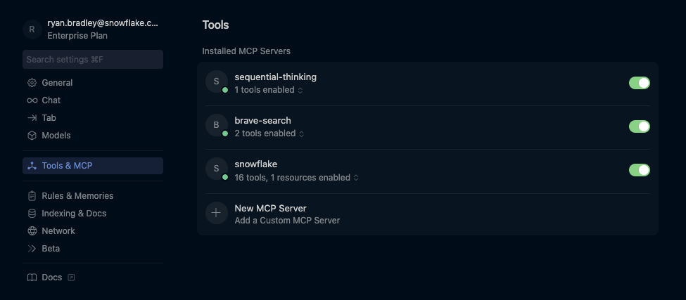

# Project Snow Owl: AI-Powered Account Research Platform

This project provides a comprehensive suite of AI prompt templates designed to leverage Cursor and MCP (Model Context Protocol) tools for efficient and thorough account research. The templates enable sales engineers and account teams to conduct deep, systematic research on target companies, industries, and executives using automated tools and structured methodologies.

## Overview

Project Snow Owl transforms traditional account research by combining the power of AI with structured prompt engineering. Each template is designed to work with Cursor's MCP tools to automate data collection, analysis, and documentation while maintaining high standards for accuracy and relevance.

### Key MCP Tools Integration

The templates leverage multiple MCP tools for comprehensive automation:

1. **Brave Search** - Comprehensive web research across business and industry sources
2. **Sequential Thinking** - Systematic analysis and problem-solving frameworks
3. **Snowflake** - Direct database access, query execution, and Cortex AI capabilities for data analysis

## Setup Instructions

### Prerequisites

Before using Project Snow Owl templates, you need to configure Cursor with the required MCP tools.

#### Node.js Installation

Both Sequential Thinking and Brave Search MCP servers require Node.js to be installed locally.

**macOS Installation:**
```bash
# Using Homebrew (Recommended)
brew install node

# Verify installation
node --version
npm --version
```

**Windows Installation:**
1. Visit [nodejs.org](https://nodejs.org/)
2. Download and run the Windows installer (.msi file)
3. Ensure "Add to PATH" is checked during installation
4. Restart your computer
5. Verify in Command Prompt: `node --version` and `npm --version`

Alternatively, use Windows Package Manager:
```cmd
winget install OpenJS.NodeJS
```

#### MCP Server Configuration

1. **Copy Configuration File:**
   - Copy `Cursor_Config/mcp.json` to your Cursor MCP directory:
   
   **macOS:**
   ```bash
   cp Cursor_Config/mcp.json ~/.cursor/mcp_config/mcp.json
   ```
   
   **Windows:**
   ```cmd
   copy Cursor_Config\mcp.json %APPDATA%\Cursor\mcp_config\mcp.json
   ```

2. **Configure Brave Search API Key:**
   - Visit [Brave Search API](https://api.search.brave.com/) and create a free account
   - Generate an API key from your dashboard
   - Edit the copied `mcp.json` file and replace `YOUR_BRAVE_API_KEY_HERE` with your actual API key

3. **Restart Cursor:**
   - Completely restart Cursor for changes to take effect
   - Look for MCP server indicators in the status bar

#### Verification

Test your setup by:
1. Opening any template from the `Prompt_Templates` directory
2. Running a prompt that uses MCP tools
3. Confirming Sequential Thinking and Brave Search are accessible

**Expected Cursor MCP Settings:**
When properly configured, your Cursor MCP settings should show both servers enabled:



You should see:
- ✅ **sequential-thinking** - 1 tools enabled
- ✅ **brave-search** - 2 tools enabled
- ✅ **snowflake** - Multiple tools enabled (if configured)

For detailed setup instructions, troubleshooting, and additional configuration options, see the [Cursor Config README](./Cursor_Config/README.md).

### Snowflake MCP Server Setup

The Snowflake MCP server enables direct database access, query execution, and Cortex AI capabilities within your research workflows.

#### Prerequisites

1. **Python and UV Package Manager:**
   ```bash
   # Install UV (if not already installed)
   pip install uv
   
   # Verify installation
   uvx --version
   ```

2. **Snowflake Account Access:**
   - Valid Snowflake account with appropriate permissions
   - Access to databases, schemas, and warehouses you plan to query
   - Optional: Cortex Search and Cortex Analyst services configured

#### Configuration Steps

1. **Create Snowflake Connection Configuration:**
   
   Create `~/.snowflake/connections.toml`:
   ```toml
   [default]
   account = "your_account"
   user = "your_username"
   authenticator = "externalbrowser"
   warehouse = "your_warehouse"
   database = "your_database"
   schema = "your_schema"
   ```

2. **Create Tools Configuration (Required):**
   
   Create `~/.snowflake/tools_config.yaml`:
   ```yaml
   cortex_search:
     - name: "my_search_service"
       database: "YOUR_DB"
       schema: "YOUR_SCHEMA"
       service_name: "YOUR_CORTEX_SEARCH_SERVICE"

   cortex_analyst:
     - name: "my_analyst"
       database: "YOUR_DB"
       schema: "YOUR_SCHEMA"
       semantic_model: "YOUR_SEMANTIC_MODEL"
   ```
   
   **Note:** Create this file even if empty - the MCP server requires it to function.

3. **Update Cursor MCP Configuration:**
   
   Add the Snowflake server to your `~/.cursor/mcp.json`:
   ```json
   {
     "mcpServers": {
       "sequential-thinking": {
         "command": "npx",
         "args": ["-y", "@modelcontextprotocol/server-sequential-thinking"]
       },
       "brave-search": {
         "command": "npx",
         "args": ["-y", "@modelcontextprotocol/server-brave-search"],
         "env": {
           "BRAVE_API_KEY": "YOUR_BRAVE_API_KEY_HERE"
         }
       },
       "snowflake": {
         "command": "uvx",
         "args": [
           "snowflake-labs-mcp",
           "--service-config-file",
           "/Users/YOUR_USERNAME/.snowflake/tools_config.yaml",
           "--connection-name",
           "default"
         ]
       }
     }
   }
   ```
   
   **Important:** Replace `/Users/YOUR_USERNAME/` with your actual home directory path.

4. **Restart Cursor:**
   - Completely restart Cursor for changes to take effect
   - Verify Snowflake appears in the MCP resources panel

#### Usage Examples

Once configured, you can interact with Snowflake directly in Cursor chat:

- **Database Exploration:**
  - "Show me tables in DATABASE.SCHEMA"
  - "Get schema for TABLE_NAME"
  - "List all databases I have access to"

- **Query Execution:**
  - "Run: SELECT * FROM customers LIMIT 10"
  - "Query the sales table for last month's data"
  - "Show me the top 10 customers by revenue"

- **Cortex AI Integration:**
  - "Use Cortex Search to find documents about pricing"
  - "Run Cortex Analyst query on my semantic model"

#### Troubleshooting

**Common Issues:**

1. **UV/UVX Not Found:**
   ```bash
   pip install uv
   # Restart terminal after installation
   ```

2. **Connection Issues:**
   - Verify your `connections.toml` credentials work with SnowSQL first
   - Ensure your Snowflake account identifier is correct
   - Check that `externalbrowser` authentication is enabled

3. **Tools Config Path:**
   - Ensure the path in `mcp.json` matches your actual home directory
   - Use absolute paths (avoid `~` shorthand in MCP configuration)

4. **MCP Server Not Loading:**
   - Check Cursor's MCP panel for error messages
   - Verify all file paths are correct and files exist
   - Restart Cursor completely after configuration changes

**Verification:**
Your Cursor MCP settings should show:
- ✅ **sequential-thinking** - 1 tools enabled
- ✅ **brave-search** - 2 tools enabled  
- ✅ **snowflake** - Multiple tools enabled (varies by configuration)

## Template Categories

### Account Research Templates

Comprehensive suite of 32 templates for systematic customer intelligence gathering and strategic account development.

#### Customer Understanding (5 Templates)
- **[Customer Stakeholder Map](./Prompt_Templates/Account-Research/01_Customer_Stakeholder_Map.md)** - Maps key decision makers and influence networks
- **[Customer Org Chart](./Prompt_Templates/Account-Research/02_Customer_Org_Chart.md)** - Analyzes organizational structure and reporting relationships
- **[Internal Champions Radar](./Prompt_Templates/Account-Research/03_Internal_Champions_Radar.md)** - Identifies potential advocates and technology champions
- **[Global Shared Services](./Prompt_Templates/Account-Research/04_Global_Shared_Services_Overview.md)** - Maps centralized functions and technology infrastructure

#### Industry & Market Context (4 Templates)
- **[Industry Analysis](./Prompt_Templates/Account-Research/05_Industry_Analysis.md)** - Analyzes industry trends and competitive landscape
- **[Regulatory Research](./Prompt_Templates/Account-Research/06_Regulatory_Research.md)** - Comprehensive compliance and regulatory analysis
- **[Competitor Landscape](./Prompt_Templates/Account-Research/07_Competitor_Landscape.md)** - Maps competitors and their technology strategies
- **[Partner Ecosystem Map](./Prompt_Templates/Account-Research/08_Partner_Ecosystem_Map.md)** - Analyzes GSI, ISV, and vendor relationships

#### Engagement & Relationships (3 Templates)
- **[Engagement Calendar](./Prompt_Templates/Account-Research/09_Engagement_Calendar.md)** - Tracks events and engagement opportunities
- **[Conference Participation Map](./Prompt_Templates/Account-Research/10_Conference_Participation_Map.md)** - Maps executive speaking and conference patterns
- **[Past Engagement Timeline](./Prompt_Templates/Account-Research/11_Past_Engagement_Timeline.md)** - Documents historical Snowflake interactions

#### Strategic Analysis (6 Templates)
- **[Board Priorities](./Prompt_Templates/Account-Research/12_Board_Priorities.md)** - Analyzes board-level strategic initiatives
- **[AI Strategy](./Prompt_Templates/Account-Research/13_AI_Strategy.md)** - Documents AI vision and implementation plans
- **[Future Strategic Milestones](./Prompt_Templates/Account-Research/14_Future_Strategic_Milestones.md)** - Identifies upcoming strategic initiatives
- **[Risk Signals & Transformation Triggers](./Prompt_Templates/Account-Research/15_Risk_Signals_Transformation_Triggers.md)** - Monitors organizational changes and urgency indicators
- **[Business Unit Workload Mapping](./Prompt_Templates/Account-Research/16_Business_Unit_Workload_Mapping.md)** - Maps data workloads by business unit
- **[Data Maturity Self-Assessment](./Prompt_Templates/Account-Research/17_Data_Maturity_Self_Assessment.md)** - Evaluates data capability maturity

#### Technical & Data Landscape (4 Templates)
- **[Vendor Stack Analysis](./Prompt_Templates/Account-Research/18_Vendor_Stack.md)** - Maps current technology vendors and partnerships
- **[Cortex Mapping](./Prompt_Templates/Account-Research/19_Cortex_Mapping.md)** - Identifies Snowflake Cortex AI use cases
- **[Earnings Mentions](./Prompt_Templates/Account-Research/20_Earnings_Mentions.md)** - Tracks technology mentions in earnings calls
- **[Public Initiatives](./Prompt_Templates/Account-Research/21_Public_Initiatives.md)** - Documents strategic programs and partnerships

#### Monitoring & Tracking (6 Templates)
- **[Quote Tracker](./Prompt_Templates/Account-Research/22_Quote_Tracker.md)** - Collects executive statements and vision
- **[Sustainability/ESG Initiatives](./Prompt_Templates/Account-Research/23_Sustainability_ESG_Initiatives.md)** - Maps ESG goals and sustainability alignment
- **[Case Studies](./Prompt_Templates/Account-Research/24_Case_Studies.md)** - Analyzes competitive implementations and success stories
- **[Executive Research](./Prompt_Templates/Account-Research/26_Executive_Research.md)** - In-depth leadership analysis and industry alignment
- **[Company News](./Prompt_Templates/Account-Research/27_Company_News.md)** - Real-time news monitoring and analysis
- **[Contract Renewal Signals](./Prompt_Templates/Account-Research/31_Contract_Renewal_Signals.md)** - Identifies technology refresh opportunities

#### Strategic Planning (4 Templates)
- **[Snowflake POV](./Prompt_Templates/Account-Research/28_Snowflake_POV.md)** - Develops comprehensive value proposition and positioning
- **[Account Planning](./Prompt_Templates/Account-Research/29_Account_Planning.md)** - Strategic account development and go-to-market planning
- **[ROI Analysis](./Prompt_Templates/Account-Research/30_ROI_Analysis.md)** - Financial impact assessment and business case development

### Research Review Templates

Quality assurance templates to ensure research accuracy and completeness.

#### [Hyperlink Verification](./Prompt_Templates/Research-Review/90_Hyperlink_Checker.md)
Systematic link validation using Sequential Thinking to verify link accessibility, content relevance, and accuracy across all account documentation. Ensures all citations have corresponding hyperlinks and validates content matches citation claims.

#### [Completion Verification](./Prompt_Templates/Research-Review/91_Completion_Verification_Template.md)
Comprehensive quality assurance checklist that ensures thorough completion of all research activities. Provides systematic verification of document completeness, citation accuracy, and cross-document consistency with specific quality metrics and follow-up actions.

#### [File Organization](./Prompt_Templates/Research-Review/99_File_Organizer.md)
Standardized file naming and organization system that ensures consistent documentation management across all accounts. Provides automated verification of naming conventions and generates rename commands for compliance with established patterns.

### SE Efficiency Templates

Tools for sales engineering productivity and reporting.

#### [SFDC SE Updates](./Prompt_Templates/SE-Efficiency/sfdc_se_updates.md)
Weekly status update template for sales and sales engineering leadership that condenses client interaction notes into concise, realistic summaries. Provides structured format for status reporting without overstating progress or making unsupported promises.

#### [Champions Deck Data Generator](./Prompt_Templates/SE-Efficiency/Champions_Deck_Data_Generator.md)
Conducts comprehensive deep research and analysis to generate all necessary data for building an effective Champion's Deck. Empowers internal advocates to drive Snowflake adoption within their organization through tailored research, strategic context, and actionable recommendations.

## Getting Started

### Prerequisites
- Cursor IDE with MCP tools configured
- Access to Brave Search and Sequential Thinking MCP tools
- Terminal access for date commands

### Basic Usage

1. **Select the appropriate template** based on your research needs
2. **Get current date** using the terminal command: `date "+%B %-d, %Y"`
3. **Replace placeholders** in the template with specific company information
4. **Execute the prompt** in Cursor, leveraging the integrated MCP tools
5. **Review and validate** output against the provided quality criteria

### Template Workflow

The templates are designed to work together in a structured research workflow:

#### Phase 1: Foundation Research
1. **Industry Analysis** - Understand market context and competitive landscape
2. **Regulatory Research** - Analyze compliance requirements and implications
3. **Executive Research** - Map leadership and decision-making structure
4. **Customer Stakeholder Map** - Identify key decision makers and influencers

#### Phase 2: Strategic Intelligence
5. **AI Strategy** - Document technology vision and implementation plans
6. **Board Priorities** - Analyze strategic initiatives and business objectives
7. **Competitor Landscape** - Map competitive positioning and technology strategies
8. **Future Strategic Milestones** - Identify upcoming initiatives and decision windows

#### Phase 3: Engagement Planning
9. **Engagement Calendar** - Track events and relationship-building opportunities
10. **Conference Participation Map** - Analyze executive speaking patterns
11. **Past Engagement Timeline** - Document historical interactions and lessons learned
12. **Risk Signals & Transformation Triggers** - Monitor urgency indicators

#### Phase 4: Technical Assessment
13. **Vendor Stack Analysis** - Map current technology ecosystem
14. **Data Maturity Self-Assessment** - Evaluate capability levels and gaps
15. **Business Unit Workload Mapping** - Identify specific use cases and requirements
16. **Cortex Mapping** - Align Snowflake AI capabilities with customer needs

#### Phase 5: Strategic Positioning
17. **Account Planning** - Synthesize research into comprehensive strategy
18. **Snowflake POV** - Develop targeted value proposition and positioning
19. **ROI Analysis** - Build financial business case and impact assessment
20. **Champions Deck Data Generator** - Enable internal advocate development

#### Phase 6: Ongoing Monitoring
21. **Company News** - Maintain current awareness of developments
22. **Earnings Mentions** - Track technology investment themes
23. **Quote Tracker** - Monitor executive vision and strategic messaging
24. Use **Review Templates** for quality assurance and validation

## Key Features

### Comprehensive Intelligence Gathering
- **32 specialized templates** covering all aspects of account research
- **Multi-phase research methodology** with systematic MCP tool integration
- **Real-time data collection** with Brave Search automation
- **Structured analysis frameworks** using Sequential Thinking for consistent insights

### Advanced Automation
- **Memory-based cross-referencing** for complex multi-template research
- **Automated source verification** and confidence level assessment
- **Chronological analysis** with proper timeframe management
- **Web automation capabilities** for data validation and collection

### Strategic Account Development
- **Complete customer lifecycle coverage** from initial research to ongoing monitoring
- **Champion development support** with dedicated Champions Deck data generation
- **Competitive intelligence** and market positioning analysis
- **ROI modeling** and financial business case development

### Quality Assurance & Validation
- **Built-in verification processes** for all research outputs
- **Confidence level documentation** for every finding
- **Source link validation** and content verification
- **Cross-template consistency** checking and validation

### Enterprise-Grade Organization
- **Standardized template structure** following REFERENCE_TEMPLATE guidelines
- **Systematic file organization** with consistent naming conventions
- **Version control integration** with Git-based change tracking
- **Scalable documentation** supporting multiple concurrent accounts

## Best Practices

### Research Methodology
- **Always verify current date** using terminal commands: `date "+%B %-d, %Y"`
- **Maintain appropriate timeframes** (12-24 months) for relevance and currency
- **Use systematic MCP tool integration** following template-specified phases
- **Document confidence levels** (High/Medium/Low) for all findings

### Source Management
- **Prioritize authoritative sources** and recent publications
- **Include direct links** with publication dates for all citations
- **Validate all claims** with verifiable public sources
- **Cross-reference findings** across multiple templates and sources

### Quality Assurance
- **Review automated outputs** for accuracy and relevance before finalization
- **Verify link accessibility** and content alignment with citations
- **Maintain cross-template consistency** in findings and recommendations
- **Update research quarterly** to maintain currency and strategic relevance

### Template Usage
- **Follow REFERENCE_TEMPLATE structure** for consistency across all research
- **Utilize Memory tool** for complex multi-template research projects
- **Store comprehensive findings** for synthesis and cross-reference analysis
- **Provide actionable insights** with specific engagement recommendations

### Account Management
- **Organize files systematically** using standardized naming conventions
- **Track research completion** across all relevant template categories
- **Coordinate template usage** for comprehensive account intelligence
- **Maintain version control** for all research documentation and updates

## Contributing

This template collection is actively maintained and improved based on user feedback and evolving research needs. For suggestions or improvements, please follow the established contribution guidelines and maintain consistency with existing template structures.

## Maintenance

Templates should be reviewed and updated quarterly to ensure:
- MCP tool integration remains current
- Industry-specific requirements are addressed
- Quality standards are maintained
- New research methodologies are incorporated
- User feedback is integrated into improvements
