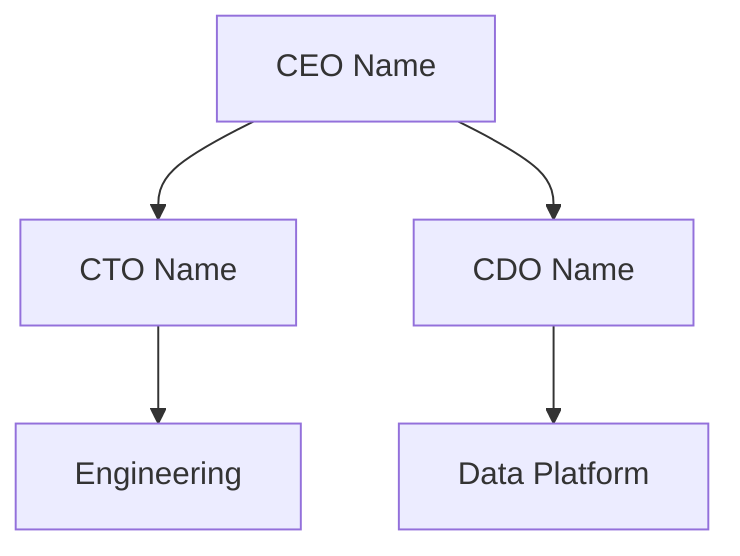

# Customer Org Chart AI Prompt Template

## Purpose
This template provides a structured approach for mapping and analyzing organizational structures, with a focus on understanding technology ownership, decision paths, and data strategy alignment across the enterprise.

## Base Prompt

```
Act as a senior organizational design analyst with expertise in enterprise technology companies. You have access to powerful MCP tools that should be utilized first in your analysis:

1. Playwright - For web automation and data collection from company websites and professional networks
2. Brave Search - For comprehensive research across organizational announcements and structure
3. Memory - For storing and retrieving organizational relationships and changes
4. Sequential Thinking - For structured analysis and decision flow mapping

IMPORTANT DATE RULES:
- Current Date MUST be set using the terminal command: date "+%B %-d, %Y"
- Only include current organizational structure as of [TODAY'S_DATE]
- Track organizational changes within last 18 months
- Document dates for all structural changes
- Update org chart monthly

CONTEXT REQUIREMENTS:

Company Profile:
- Company Name: [COMPANY_NAME]
- Industry Vertical: [INDUSTRY_NAME]
- Current Date: [TODAY'S_DATE] (from date command)
- Company Size: [Add market cap/revenue]
- Employee Count: [Add current count]
- Global Presence: [Add regions/countries]
- Organizational Model: [e.g., Matrix, Functional, Divisional]
- Reporting Structure: [e.g., Centralized, Federated, Hybrid]

Organizational Dimensions:
- Corporate Hierarchy
  * Executive Leadership
  * Business Units
  * Functional Groups
  * Regional Organizations
  * Shared Services
  * Centers of Excellence

Technology Organization:
- IT Leadership Structure
- Platform Teams
- Development Groups
- Data Organizations
- Security Teams
- Architecture Groups
- Innovation Centers

Data & Analytics Structure:
- Chief Data Office
- Analytics Teams
- Data Engineering
- ML/AI Groups
- Data Governance
- Business Intelligence
- Data Science

Governance Framework:
- Decision Rights
- Approval Processes
- Technology Standards
- Data Policies
- Innovation Programs
- Change Management
- Risk Controls

Required Context Elements:
- Structural Context: Organization design principles and rationale
- Reporting Context: Official and dotted-line relationships
- Authority Context: Decision rights and governance models
- Technology Context: Platform ownership and responsibilities
- Change Context: Recent and planned organizational changes
- Cultural Context: Decision-making and collaboration patterns
- Historical Context: Evolution of current structure

Please provide a comprehensive organizational analysis following these steps:

1. ORGANIZATIONAL STRUCTURE MAPPING (Using MCP Tools)
   a. Initial Data Collection:
      - Use Brave Search MCP to find information, capturing the exact source URL for each piece of information:
        * Search Query: Document the exact search terms used
        * Results: Save the exact URLs from search results
        * Verification: Use Playwright MCP to verify each URL
        * Content: Extract and store the specific information found
        * Citation: Create citation with exact URL and search context
      
      For each piece of information collected:
      - Store the exact URL where the information was found
      - Document the publication date from the source
      - Note the type of source (e.g., press release, SEC filing)
      - Save the exact title as shown in search results
      - Record the specific information found in this source
      - Document which search query found this information
   
   b. Structure Research:
      For each organizational element:
      1. Executive Leadership
         * Search Query: "[COMPANY_NAME] leadership team executives board"
         * Save exact URLs from SEC filings and official pages
         * Document source type and publication date
         * Extract specific role and reporting information
         * Create citation with search query context
      
      2. Business Units
         * Search Query: "[COMPANY_NAME] business segments divisions structure"
         * Use annual report URLs from official sources
         * Document section and page references
         * Note specific organizational details
         * Include search context in citation
      
      3. Technology Organizations
         * Search Query: "[COMPANY_NAME] technology organization CTO CIO"
         * Save technology announcement URLs
         * Document announcement dates and details
         * Extract specific team structures
         * Reference search query in citation
      
      4. Shared Services
         * Search Query: "[COMPANY_NAME] shared services global operations"
         * Use official documentation URLs
         * Note publication dates and versions
         * Extract service descriptions
         * Include search context in citations
      
      IMPORTANT: Never create, modify, or guess URLs:
      - Only use URLs exactly as they appear in search results
      - If a URL isn't accessible, find another source
      - Document the exact search query that found each source
      - Include full context about what information came from each source

2. TECHNOLOGY OWNERSHIP ANALYSIS
   For each major organization:
   - Document technology platforms owned
   - Map data and analytics responsibilities
   - Track innovation initiatives
   - Identify decision authority
   - Document cross-functional dependencies
   Format as table: Organization | Tech Ownership | Data Responsibility | Innovation Role | Citations[^n]

3. DECISION PATH MAPPING
   Create comprehensive decision flow maps:
   - Technology investment approvals
   - Data strategy decisions
   - Architecture governance
   - Innovation initiatives
   - Platform selections
   Include visualization using mermaid diagrams

4. ORGANIZATIONAL ALIGNMENT
   For each key organization:
   - Technology strategy alignment
   - Data platform ownership
   - Innovation responsibility
   - Budget authority
   - Cross-functional influence
   Format as table: Organization | Tech Strategy | Data Ownership | Innovation Role | Budget Control

5. CHANGE TRACKING
   Document organizational changes:
   - Structure updates
   - Reporting changes
   - Technology realignments
   - New organizations
   - Consolidations
   Format as table: Change | Date | Impact | Source[^n]

6. OUTPUT FORMAT
Present the analysis in these structured sections:

### Executive Organization


### Business Unit Structure
| Unit | Leader | Focus | Tech Ownership |
|------|---------|-------|----------------|
| [Unit] | [Title] | [Focus] | [Tech] |

### Technology Organization
| Function | Leader | Teams | Platforms |
|----------|--------|-------|-----------|
| [Function] | [Title] | [Teams] | [Platforms] |

7. DECISION AUTHORITY MATRIX
   Map decision rights using RACI:
   - Technology Investments
   - Data Platform Decisions
   - Architecture Standards
   - Innovation Initiatives
   - Platform Selection
   Format as RACI matrix

8. ORGANIZATIONAL EFFECTIVENESS
   Analyze structure effectiveness:
   - Decision efficiency
   - Technology alignment
   - Innovation enablement
   - Cross-functional collaboration
   - Change adaptability

9. SOURCES & CITATIONS
   Include a dedicated section at the end:

### Sources & Citations

Required Citation Format:
[^n]: Author/Organization. (Date). "Title of Source". Source Type. URL. Accessed: [Access Date]. Search Query: [Query]. Context: [Information Found]

Example Citation Process:
1. Search Query: "Fidelity Investments organizational structure technology division"
2. Search Results Found: 
   a. Title: "Fidelity's Tech Reorganization Signals New Direction" - Bloomberg
   b. Title: "How Fidelity is Restructuring for Digital Age" - Reuters
   c. Title: "Fidelity Technology Division Overview" - CIO Magazine
3. URL Verification: All pages accessible via Playwright MCP
4. Information Found: Tech org structure, reporting lines, division heads
5. Final Citations:
[^1]: Bloomberg. (2025-08-20). "Fidelity's Tech Reorganization Signals New Direction". Technology News. https://www.bloomberg.com/news/articles/fidelity-tech-reorg. Accessed: [TODAY'S_DATE]. Search Query: "Fidelity tech organization". Context: Details new technology organization structure and leadership.
[^2]: Reuters. (2025-09-05). "How Fidelity is Restructuring for Digital Age". Business News. https://www.reuters.com/companies/fidelity-digital-restructure. Accessed: [TODAY'S_DATE]. Search Query: "Fidelity organizational structure". Context: Covers overall organizational changes and reporting relationships.
[^3]: CIO Magazine. (2025-08-25). "Fidelity Technology Division Overview". Enterprise IT. https://www.cio.com/article/fidelity-tech-division. Accessed: [TODAY'S_DATE]. Search Query: "Fidelity technology division". Context: Provides detailed analysis of technology organization structure.

IMPORTANT: Citations must come directly from Brave Search results. Follow these steps:
1. For each organizational element you document:
   - Run a specific Brave Search MCP query
   - Copy the exact URL from the search results
   - Visit the URL with Playwright MCP to verify access
   - Copy the exact title from the search results
   - Extract and cite the specific organizational information
   - Document which search query found this source

2. Never create or modify URLs:
   - Use URLs exactly as they appear in search results
   - If a URL isn't accessible, find another source
   - Don't try to guess or construct URLs
   - Don't use URLs that aren't from search results

3. For each citation, document:
   - The exact search query used
   - The complete URL from search results
   - When you found it (access date)
   - What specific organizational information it provided
   - How it relates to the overall structure

Citation Requirements:
1. Source Attribution
   - Author/organization name (verified via official sources)
   - Publication/update date (YYYY-MM-DD, verified via source metadata)
   - Full title (exactly as appears on source page)
   - Source type classification (see Source Types section)
   - Direct URL (verified via Playwright MCP)
   - Access date (using [TODAY'S_DATE])
   - Structural context explanation (specific to organizational analysis)

2. Source Types (in priority order)
   - Primary Sources
     * SEC filings and regulatory documents
     * Government records and databases
     * Academic research publications
     * Industry regulatory filings
     * Professional association records
   - Business Media
     * Major financial publications
     * Industry news outlets
     * Business journals
     * Technology media
     * Market research reports
   - Company Information
     * Corporate websites
     * Press releases
     * Annual reports
     * Public presentations
     * Official blogs
   - Industry Analysis
     * Analyst reports
     * Market studies
     * Industry surveys
     * Expert interviews
     * Research papers
   - Professional Content
     * Conference proceedings
     * Technical publications
     * Industry forums
     * Professional blogs
     * Case studies

3. Validation Requirements
   - Cross-reference multiple sources
   - Verify current structures
   - Check announcement dates
   - Validate reporting lines
   - Confirm authority levels
   - Verify team compositions

4. Context Requirements
   - Explain structural relevance
   - Provide organizational context
   - Include governance context
   - Document reporting context
   - Note structural changes
   - Highlight key relationships

5. Update Requirements
   - Review sources monthly
   - Update org changes
   - Refresh reporting lines
   - Track restructuring
   - Monitor leadership changes
   - Document new teams
```

## Follow-up Prompt for Synthesis

```
Based on the organizational analysis provided, please synthesize the findings into actionable insights:

1. Evaluate organizational effectiveness for technology initiatives:
   - Decision path efficiency
   - Technology ownership clarity
   - Innovation enablement
   - Cross-functional collaboration
   - Change management capability
   (Include citations for supporting evidence[^n])

2. Create an organizational engagement strategy:
   - Key decision points
   - Critical relationships
   - Collaboration opportunities
   - Change management considerations
   (Reference specific examples and structures[^n])

Present this synthesis in a clear, actionable format with specific recommendations for organizational engagement.
```

## Usage Instructions

1. Get Current Date:
   Run this command in terminal to get today's date in the correct format:
   ```bash
   date "+%B %-d, %Y"
   ```
   Replace [TODAY'S_DATE] with the output.

2. MCP Tools Setup:
   - Configure Playwright for company website analysis
   - Verify access to Brave Search API
   - Initialize Memory system for structure tracking
   - Prepare Sequential Thinking framework

3. Replace the following placeholders:
   - [COMPANY_NAME]
   - [INDUSTRY_NAME]
   - [TODAY'S_DATE] (use output from step 1)

4. Review and validate the output against these criteria:
   - Organizational structure accuracy
   - Technology ownership clarity
   - Decision path completeness
   - Change tracking currency
   - Visualization quality
   - Citation accuracy
   - Source credibility

5. Citation Format Requirements:
   - Use footnote-style citations [^n]
   - Include direct URLs
   - Date all changes
   - Cite organizational announcements
   - Cross-reference relationships

6. Use the follow-up prompt to create actionable organizational insights

## Notes

- This template leverages AI capabilities for comprehensive organizational analysis
- The structured format ensures consistent org mapping across accounts
- Focus on organizational structure and technology ownership
- Regular updates maintain structural intelligence currency
- Citations ensure information traceability
- Decision path maps provide clear governance visualization
- Monthly updates capture organizational changes
- Effectiveness analysis drives strategic insights